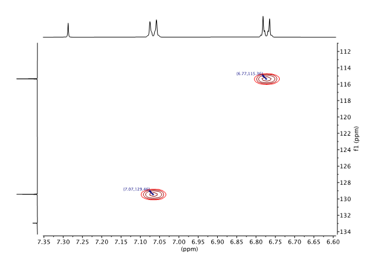
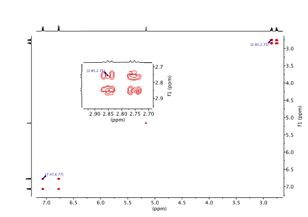

Data Preparation
================

Introduction
------------

This document outlines the best way to process a set of NMR spectra
using Mnova and extract the information necessary for use with the
simplePredict tool. It also discusses how tave and name your data so
that the simpleNMR suite of tools can find your data.

Since simplePredict can cope with various amounts of input (presence or
absence of certain spectra), the information below is in the form of
general guidance but, in this document, we assume that we are working on
a data set containing the most commonly encountered set of experiments,
namely: 1D-:sup:`1`\ H, :sup:`1`\ H-Pureshift (PSYCHE),
1D-:sup:`13`\ C{:sup:`1`\ H}, :sup:`1`\ H-:sup:`1`\ H COSY,
:sup:`1`\ H-:sup:`13`\ C HSQC, and :sup:`1`\ H-:sup:`13`\ C HMBC. The
HSQC experiment includes multiplicity editing to facilitate the easy
identification of CH\ :sub:`2` groups. The actual set of experiments
used may vary over time and with the particular application, but the
general guidance will still be applicable.

Directory Structure and File Naming
-----------------------------------

For each new molecule that is being assigned using simpleNMR create a
unique directory based on the sample name of the molecule. If a student
had made aspirin as part of a project then the student should save the
data in a directory called aspirin_1 for example.

The MNOVA file corresponding to this file should should be saved in this
directory under the same name.

.. image:: media/image1.png
   :alt: Directory structure and naming convention
   :width: 6.26806in
   :height: 1.98125in

Figure 1 Directory structure and naming convention dorm nova files used
with simpleNMR tools.

Processing Steps
----------------

The following bullet points are general rules and advice when processing
the NMR data for use with the simpleNMR tool set.

-  Process the data so as to facilitate the accurate extraction of the
   required data. For all spectra, ensure the use of zero filling before
   FT (at least a factor of two). In the case of 2D spectra, the
   acquired data will typically be severely truncated in both
   dimensions. So, assuming that we have a reasonable S/N ratio, it is a
   good idea to double the number of data points acquired using forward
   linear prediction and then double the size of that using zero filling
   (in both dimensions). This helps considerably with the accurate
   positioning of correlations. Note, however, that large 2D datasets
   will considerably slow down the response of the processing software
   (how large depends to some extent on how much memory is present in
   the processing computer). It is also worth considering whether the
   data has been acquired using compressive sensing (non-uniform
   sampling) in the indirect dimension. If compressive sensing has been
   used and reconstruction has then yielded a large dataset in that
   dimension already (say 1k or greater), then linear prediction should
   probably not be applied. For a more detailed discussion of this topic
   see Section 4 of “Minimizing the risk of deducing wrong natural
   product structures from NMR data”, D. C. Burns, W. F. Reynolds,
   *Magn. Reson. Chem*. (2021), **59**, 500–533, and references therein.

-  Ensure all spectra are correctly phased if appropriate, and baseline
   correct as necessary (particularly the 1D-:sup:`1`\ H spectrum if
   integrals are to be used).

-  Check that the referencing is consistent between the 1D and 2D
   spectra. It should be consistent by default but, if it is not, make
   the necessary adjustments. Note that in this case consistency of
   referencing (so that peaks align properly) is more important than
   absolute accuracy, so don’t worry too much at this stage about which
   spectrum has the correct referencing. Just get them to line up.

-  Have a look at the HSQC spectrum. This is the key spectrum in the
   data set. In particular, make a note of any proton signals that do
   not show an HSQC correlation (such as amide NH’s) and any
   correlations to proton signals that are overlapped. This is quite
   common, which is why the extra dispersion available in the HSQC is so
   valuable.

-  You are now ready to “peak pick” the correlations in the 2D data
   sets. Note that we are not necessarily going to pick the actual
   peaks. Rather, we are going to identify chemical shift correlations
   as accurately as we can. The easiest way to do this, assuming that
   you have the appropriate data sets, is to use the simplePeakPick tool
   (see the appropriate documentation).

-  If you do not have a :sup:`1`\ H-Pureshift experiment in your dataset
   and so cannot use the simplePeakPick tool, it is still possible to
   mark the 2D correlations “by hand”, although this is considerably
   more time consuming. Expand a portion of the spectrum so that you can
   easily see the correlations at a reasonable size. Under Peak Picking,
   click on the “Peak by Peak” icon (do not use “Auto Peak Picking”).
   Scroll the mouse so that the crosshairs appear on the spectrum, then
   press the shift key. This turns off the “jump to nearest peak”
   function, so you are now free to position the crosshairs exactly
   where you want them. Scroll the mouse to position the cross-hairs
   over a correlation then align the cross hairs with the corresponding
   carbon peak in the 1D-:sup:`13`\ C spectrum and with the centre of
   the corresponding proton multiplet in the 1D-:sup:`1`\ H spectrum.
   Note that this may not actually be on a local maximum in the 2D
   spectrum. See the example in the figure below. Click on the left
   mouse button to “peak pick” (ie define) that position. Repeat the
   procedure for other correlations until you have picked all the
   required correlations.

-  When you “peak pick” the HMBC spectrum (either using the
   simplePeakPick tool or “by hand”), there are a couple of caveats.
   First you do not need to “pick” correlations to proton signals that
   did not show a correlation in the HSQC experiment. It is not a
   disaster if you do, but the simplePredict tool makes no use of them
   so you are just wasting your time and it is potentially unhelpful.
   Second, you need to set the threshold sensibly and may need to adjust
   it during the “picking” process. Given the sensitivity of modern
   instruments, HMBC is often capable of detecting weak correlations
   over more than 3 bonds, which generally do not help greatly. So how
   do you know if you have the threshold set correctly? There is no hard
   and fast rule but if you are seeing an *average* of 2 or 3
   correlations per carbon, that is probably plenty. Don’t worry that
   you might be missing a correlation or two. There is generally a lot
   of redundant information in the HMBC so you are unlikely to need
   them. The converse of that is that if you have adjusted the threshold
   to suit a couple of methyl singlets in the proton spectrum of your
   molecule you are likely to be missing most of the correlations from
   highly-coupled CH multiplets elsewhere in the spectrum. And if you
   set the threshold to suit the lowest intensity CH multiplet, you may
   well see correlations over 4, 5, or even six bonds from a methyl
   singlet. So you may need to pick a sensible number of correlations
   from the methyl signals first, then turn up the intensity so that you
   can see correlations from other signals.

Figure 2 2-D peak picking showing peak position between centre of proton
doublets.

If you get to the point where you are seeing significant amounts of
1-bond breakthrough you have almost certainly turned the intensity up
too far. Err on the side of fewer rather than more and if you don’t have
enough information when you come to use the simplePredict tool you can
always go back and pick a few more correlations. Finally, if you look at
a correlation in the HMBC and you can’t tell for sure which two signals
in the respective 1D spectra are correlated, don’t pick it. The
redundant information in the HMBC means you are unlikely to need it.
Conversely, a false correlation in your data will be highly confusing
when you run it through the simplePredict tool. This is usually only a
problem where you have near degeneracy of signals in either the
1D-:sup:`1`\ H or 1D-:sup:`13`\ C spectra.

-  When looking at a classic COSY spectrum, only pick the correlations
   you can reliably identify. As before, if you are not using the
   simplePeakPick tool, pick positions that align with the centres of
   the corresponding proton multiplets in the 1D-:sup:`1`\ H spectrum
   and leave out any correlations where you cannot be sure what is
   correlating to what (again, only a problem where you have significant
   peak overlap). You do not need to pick peaks that lie on the diagonal
   (they contain no information) and if you pick a correlation on one
   side of the diagonal you do not need to pick the symmetric peak on
   the other side of the diagonal. So the number of peaks you pick will
   be only a fraction of the peaks visible in the spectrum – see the
   example in the figure below. Note that, as shown in the inset
   expansion, the “picked” position does not necessarily correspond to a
   local maximum in the 2D spectrum.

Figure 3 COSY 2D peak picking showing that position of pick peak does
not necessarily correspond to a peak maximum.
