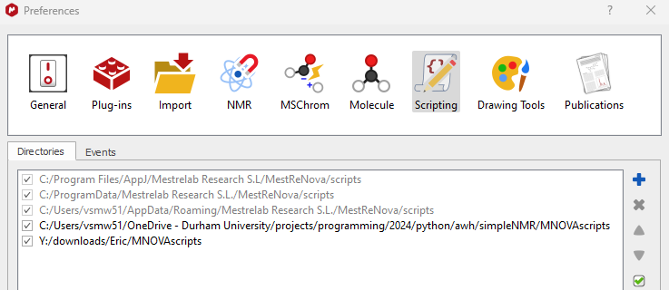

simpleNMR MNOVA Installation
============================

Introduction
------------

The simpleNMR suite of tools are now embedded in MNOVA. This decision
was made because Durham University, where the software was developed,
has a site license for MNOVA and it is the software of choice for the
students to process their NMR data.

In this instruction note we show how to install the simpleNMR tools in
MNOVA. With the help of Mestrelab Research, we have simplified the
process as much as possible.

Setting up simpleNMR in MNOVA
-----------------------------

All the simpleNMR qs scripts that run in MNOVA are in the folder
MNOVAscripts. This folder can be stored anywhere on your computer, or,
as we have done at Durham University, they can be stored on a shared
drive where all the students can access them and they can be updated
easily.

For example, if the MNOVAscripts are installed at

Y:\\downloads\\Eric\\MNOVAscripts

Do the following:

-  Open the MNOVA software and click on the cog icon in the right-hand
   corner of the toolbar

.. image:: media/image1.png
   :alt: The cog icon in MNOVA
   :width: 2.59411in
   :height: 1.10432in

Figure 1 Click on the cog icon in MNOVA

-  A dialog window opens. Click on the scripting icon

Figure 2 Click on the scripting icon

-  Click on the + icon in the dialog on the right

.. image:: media/image3.png
   :alt: Click on the + icon to add new directory
   :width: 6.26806in
   :height: 2.78958in

Figure 3 Click on the + icon to add the directory path

-  Add the directory path to MNOVAscripts

Figure 4 Add the directory path to MNOVAscripts

-  Restart MNOVA to see the simpleNMR tools installed in MNOVA

Figure 5 simpleNMR tools installed in MNOVA
