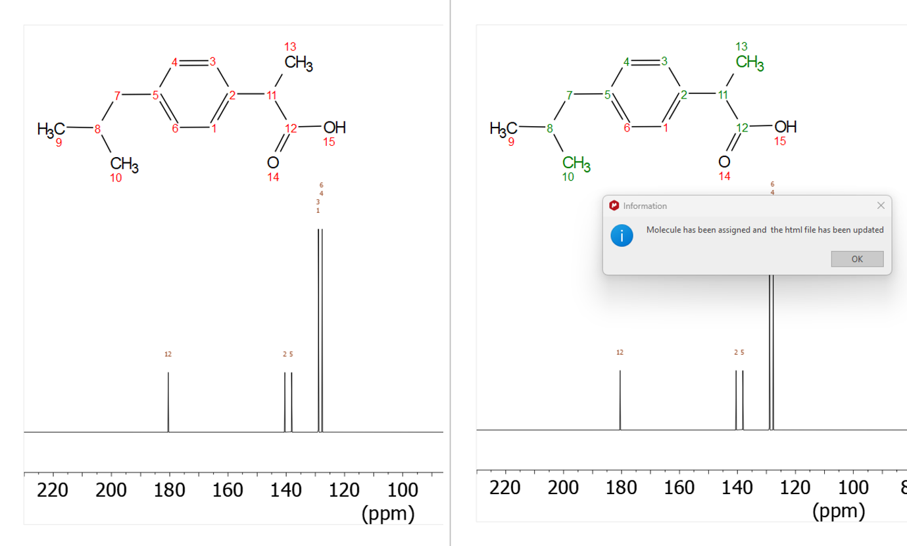
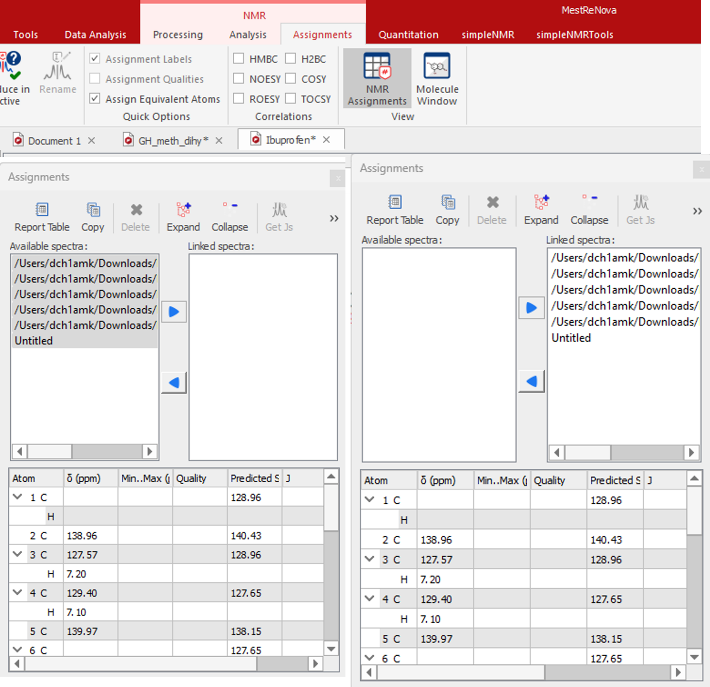
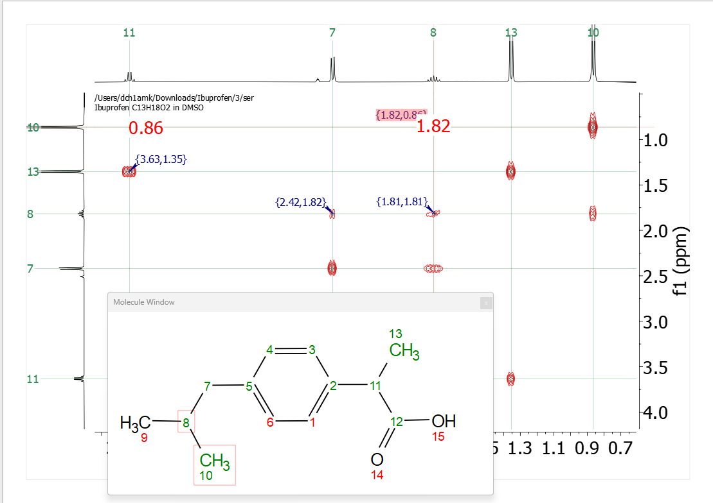

simpleASSIGN
============

Introduction
------------

The simpleASSIGN tool brings the assignment back from the html file
produced by the simplePREEDICT tool into MNOVA. From there the user can
use the MNOVA assignment tools to link the spectra with the molecule.

Once the NMR data has been predicted and checked in the simplePREDICT
tool, and the export button has been clicked to export the nmr data back
into MNOVA via a json file all the user has to do is click the
simpleASSIGN icon in the ribbon tool bar of simpleNMRtools.

The atom numbers on the molecular structure in MNOVA will go from red to
green and the html gui page will be redisplayed.

Figure 1 Molecule before and after assignment

The assignments can be linked to the MNOVA NMR spectra by clicking the
Assignments button in the NMR tab of the main Mnova toolbar. Then click
on the NMR Assignments Table icon and then select some or all of the
spectra in the left-hand pane and copy them to the right-hand pane.

Figure 2 NMR Assignments dialog showing spectra copied from left to
right.

The spectra in MNOVA now become linked to the molecule and the user can
hover over the molecule or the spectra to see the correlations in the
different NMR spectra highlighted

Figure 3 COSY spectrum showing correlation between the protons on carbon
8 and 10 in the molecule by hovering over the peak label in the COSY
spectrum at (0.82,1.82) ppm.
