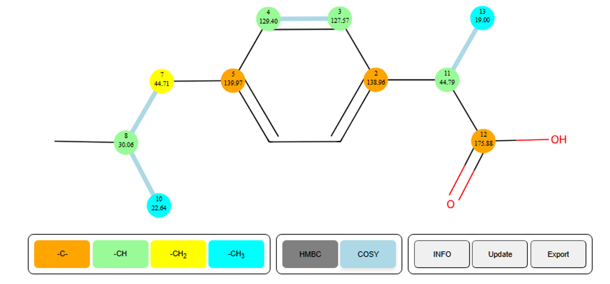

SimpleNMR HTML GUI Interface
============================

Introduction
------------

The simplePREDICT tools writes the results of the prediction and
assignment into a standalone html file. This file can be displayed in a
browser window and is small enough to be sent via email to other users
or included as supplementary information in a publication. To display
properly, the browser must have access to the internet as it uses the
d3.js library to display the interactive graph networks of the COSY and
HMBC correlations over a static svg image of a molecular structure
supplied by the user.

In this note, the features of the html display will be outlined.

.. image:: media\\image1.png
   :alt: simpleNMR HTML output
   :width: 6.26806in
   :height: 3.69306in

Figure 1 HTML output of a predicted and assigned ibuprofen example.

HTML GUI Description
--------------------

The main features of the interface will be described below.

SVG molecule
~~~~~~~~~~~~

The GUI includes a background image of a 2-D representation of the
molecular structure.

Carbon nodes
~~~~~~~~~~~~

Nodes are placed overlaying the background image to represent the NMR
distinct carbon atoms.

-  Each carbon atom node is colour coded to depict the number of protons
   attached to the carbon (CH\ :sub:`3`, CH\ :sub:`2`, CH, and C)

-  The experimental carbon chemical shift is written on top of each node
   together with the atom number derived from the MNOVA molecule display

   -  The displayed atom number does not necessarily correspond to the
      atom index in a mol file representation of the molecule.

-  The nodes can be moved by the user if the user thinks that the
   predictions are not correct and a better arrangement of the carbon
   atoms is valid.

COSY and HMBC Correlations
~~~~~~~~~~~~~~~~~~~~~~~~~~

The COSY and HMBC correlations are represented as edges in a graph
network between the carbon nodes.

-  The COSY correlations are shown by default, they are the sky-blue
   lines. They can be toggled off by clicking the COSY button

Figure 2 COSY correlations are shown in blue.

-  The HMBC correlations are hidden in the first instance, but if the
   user hovers over a carbon node with the cursor the HMBC correlations
   for that carbon node will be displayed.

..

   .. image:: media/image3.png
      :alt: HMBC correlations displayed upon hover
      :width: 4.57277in
      :height: 3.61216in

Figure 3 HMBC correlation network displayed on moving the cursor over
carbon atom 8. Nodes in the HMBC correlation network are linked by grey
lines. The node diameters of carbon atoms in the HMBC network are
increased. Nodes that are not in the network are made less opaque and
the annotations on the node are made invisible.

-  Further information is displayed upon hovering over a carbon node.
   (see Figure 3)

   -  The displayed atom number and the number of protons attached

   -  The experimental and (predicted) carbon chemical shift.

   -  The proton chemical shift of any attached protons to the carbon.

Interactive Features of the HTML GUI
~~~~~~~~~~~~~~~~~~~~~~~~~~~~~~~~~~~~

Since the image is an SVG image and the nodes and edges are displayed
using the d3.js library, the display has a number of interactive
features.

-  The graphical display can be shrunk and expanded using the wheel on
   the mouse

-  The image can be moved around the screen by clicking on a blank part
   of the screen, holding down the left mouse button, and moving the
   mouse to drag the image around the screen.

-  The image can be rotated clockwise and anti-clockwise in 10 degree
   steps by pressing the “R” and “L” keys. Holding the shift key down at
   the same time will rotate the image by 90 degrees.
