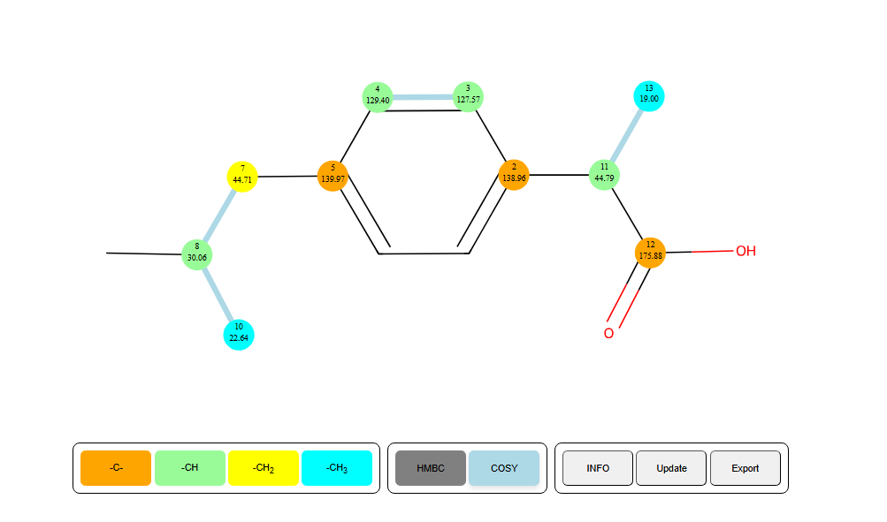
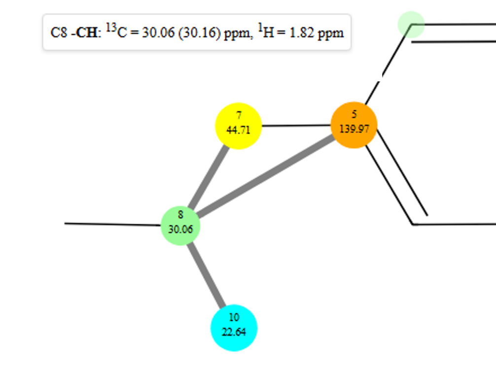
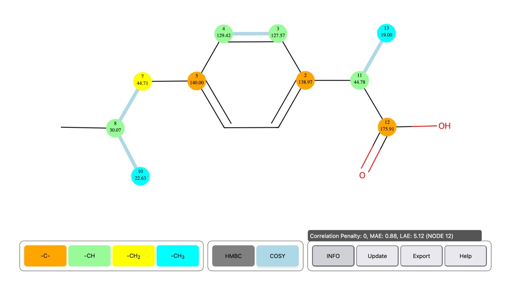

SimpleNMR HTML Graphical User Interface (GUI) 
==============================================

Introduction
------------

The simplePREDICT tools write the results of the prediction and
assignment into a standalone html file. This file can be displayed in a
browser window and is small enough to be sent via email to other users
or included as supplementary information in a publication. To display
properly, the browser must have access to the internet as it uses the
d3.js library to display the interactive graph networks of the COSY and
HMBC correlations over a static svg image of a molecular structure
supplied by the user.

In this note, the features of the html display will be outlined.

|simpleNMR HTML output|

Figure 1. HTML output of a predicted and assigned ibuprofen example.

HTML GUI Description
--------------------

The main features of the interface will be described below.

SVG molecule
~~~~~~~~~~~~

The GUI includes a background image of a 2-D representation of the
molecular structure.

Carbon nodes
~~~~~~~~~~~~

Nodes are placed overlaying the background image to represent the NMR
distinct carbon atoms.

- Each carbon atom node is colour coded to depict the number of protons
  attached to the carbon (CH\ :sub:`3`, CH\ :sub:`2`, CH, and C)

- The experimental carbon chemical shift is written on top of each node
  together with the atom number derived from the MNOVA molecule display

- The displayed atom number does not necessarily correspond to the atom
  index in a mol file representation of the molecule, but is linked to
  the mol file atom index by the program. The Displayed atom numbers are
  then able to be edited by the user in MNOVA or in the original program
  where it was created, such as ChemDraw.

- The nodes can be moved by the user if the user thinks that the
  predictions are not correct and a better arrangement of the carbon
  atoms is valid (drag & drop).

The COSY and HMBC correlations are represented as edges in a graph
network between the carbon nodes.

- The COSY correlations are shown by default, they are the sky-blue
  lines. They can be toggled off by clicking the COSY button

|COSY correlations are in blue|

Figure 2. COSY correlations are shown in blue.

- The HMBC correlations are hidden in the first instance, but if the
  user hovers over a carbon node with the cursor the HMBC correlations
  for that carbon node will be displayed.

- Clicking on the HMBC button will display all the HMBC correlations
  over the molecule. HMBC correlations greater than 3 bonds are shown in
  red, otherwise they are shown in grey.

|HMBC correlations displayed upon hover|

Figure 3 HMBC correlation network displayed on moving the cursor over
carbon atom 8. Nodes in the HMBC correlation network are linked by grey
lines. The node diameters of carbon atoms in the HMBC network are
increased. Nodes that are not in the network are made less opaque and
the annotations on the node are made invisible.

- Further information is displayed by hovering the mouse pointer over a
  carbon node. (see Figure 3). A box appears in the top left corner of
  the screen, containing:

  - The displayed atom number and the number of protons attached

  - The experimental and (predicted) carbon chemical shift.

  - The proton chemical shift of any attached protons to the carbon.

- Hovering the mouse pointer over the “INFO” button brings up three
  additional pieces of information (see Figure 4). These are:

  - Correlation Penalty – the Correlation Penalty is designed to provide
    a quick indication of how well the assignment accounts for the COSY
    and HMBC correlations. The usual “rule of thumb” when using COSY and
    HMBC correlations to make assignments is to assume that the
    correlations only extend over two or three bonds. Of course, in
    practice, correlations are found to sometimes extend over four bonds
    and (very occasionally) over more than four bonds. A Correlation
    Penalty of zero means that no correlation extends over more than
    three bonds. Each correlation that extends over four bonds increases
    the Correlation Penalty by one. A Correlation Penalty of one or two
    (for example) indicates the presence of one or two four-bond
    correlations. Longer correlations increase the Correlation Penalty
    significantly. A five-bond correlation increases the Correlation
    Penalty by eight, while a six-bond correlation increases it by 27.
    Ideally, a correct assignment should have a low single digit (or
    zero) Correlation Penalty. An assignment with a Correlation Penalty
    of eight or more should be regarded as highly questionable.

  - Mean Absolute Error (MAE) – the average (absolute) discrepancy
    between the predicted carbon shift and the observed carbon shift for
    each carbon atom.

  - | Largest Absolute Error (LAE) - the largest (absolute) discrepancy
      between the predicted carbon shift and the observed carbon shift.
      If the INFO button is clicked, the node with the largest absolute
      error is highlighted in red to make identification easier.
    | |image1|
    | Figure 4. The additional information revealed by hovering the
      mouse pointer over the “INFO” button.

Interactive Features of the HTML GUI
~~~~~~~~~~~~~~~~~~~~~~~~~~~~~~~~~~~~

Since the image is an SVG image and the nodes and edges are displayed
using the d3.js library, the display has a number of interactive
features.

- The graphical display can be shrunk and expanded using the wheel on
  the mouse

- The image can be moved around the screen by clicking on a blank part
  of the screen, holding down the left mouse button, and moving the
  mouse to drag the image around the screen.

- The image can be rotated clockwise and anti-clockwise in 10 degree
  steps by pressing the “R” and “L” keys. Holding the shift key down at
  the same time will rotate the image by 90 degrees.

.. |COSY correlations are in blue| image:: ./media/image2.png
   :width: 6.26806in
   :height: 2.92639in

