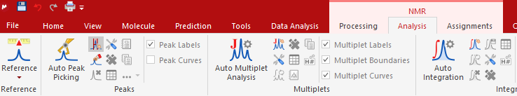
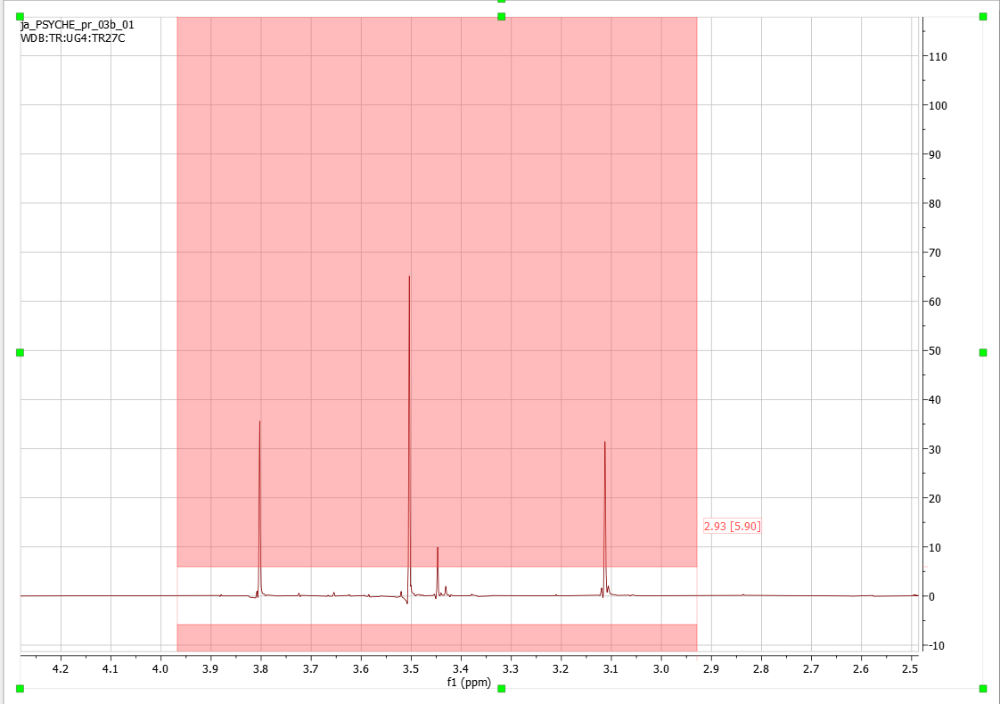
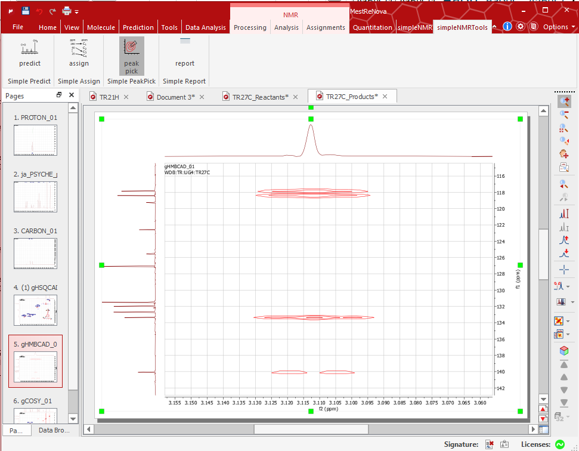
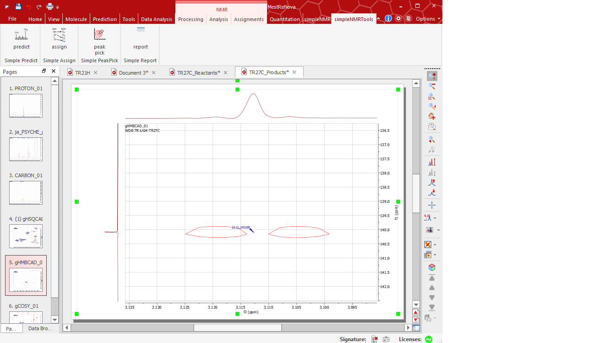

simplePeakPick
==============

Introduction
------------

Precise 2D peak picking is required for the simpleNMR tools to work
correctly. Using MNOVA 2D manual peak picking is somewhat challenging,
but if it is necessary you should refer to the notes in the Data
Preparation document. The simplePeakPick tool has been developed to make
the process simpler. The tool requires a :sup:`1`\ H Pureshift (PSYCHE)
and a 1D-carbon spectrum to be available. If the Pureshift spectrum is
not available, the tool has been updated so that the user can use the
proton information from the HSQC spectrum to peak pick automatically the
other 2D datasets.

1-D peak picking the Pureshift and Cabon Spectra
------------------------------------------------

The pureshift and carbon spectrum are first peak picked and the
positions of the peaks are used as cluster points that the picked 2D
peaks snap to.

Peak pick the carbon and pureshift spectra. This is best done using the
manual threshold peak picking tool. Do not include the solvent signal,
TMS, or any impurities. Check that the number of carbon peaks you have
picked is the same as the number of carbon signals you expect for your
structure.

Figure 1 Manual Threshold being chosen for peak picking

Figure 2 shows the manual threshold tool in action.

Figure 2 Manual Threshold being used on a pureshift spectrum

HSQC spectrum alternative
-------------------------

As stated in the introduction, if the Pureshift prton spectrum is
unavailable, the tool has been updated to use the proton information
from a peak picked HSQC spectrum.

The HSQC spectrum should be peak picked manually. With peaks picked at
the centre of the hsqc peak in the proton dimension which could be at
the centre of proton doublet or even multiplet and not at the peak
maximum.

Use CTRL+k to peak pick and press the shift key in order to move the
mouse smoothly over the peak and not jump to a maximum peak.

Peak Picking a 2-D Spectrum using the Tool.
-------------------------------------------

Choose a 2-D spectrum. Zoom in around a few peaks. Set the threshold so
that the weak peaks are removed and the peaks remaining are well above
the noise. Click the simplePeakPick tool and if the 2-D peaks occur at a
carbon/pureshift intersection then the peak will be picked at the
coordinates of the intersection.

Figure 3 Peak picking of 2-D dataset using simplePeakPick Took.

If the 2-D peak is an even multiplet (such as a doublet) then the
position of the picked peak will be in the centre of the multiplet,
which will not correspond to a peak maximum in the 2D spectrum.

Figure 4 Peak picked at centre of doublet using simplePeakPick tool, not
at a 2D peak maximum.

If the peak position is offset or misaligned, then this corresponds to
an incorrect peak and should be deleted before moving on to a new area
of the spectrum.
