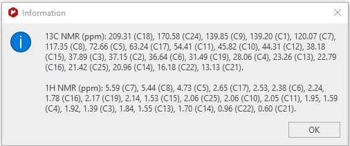

simpleREPORT
============

Introduction
------------

Once the data has been predicted and assigned and the user is happy with
the results, a report of the carbon and proton chemical shifts can be
created that is pasted to the clipboard ready to be copied into MNOVA or
a WORD document for example.

The Figure below shows the information dialog that is displayed after
clicking on the simpleREPORT icon. The information is provided as a
chemical shift and the assignment of that shift (in brackets). In the
case of proton data, the assignment is to the carbon atom to which the
proton is attached. This is not necessarily a suitable final form in all
cases. For example, if the user wants to include analysis of proton
J-couplings that needs to be added in separately. But the data presented
does neatly summarise the assignments arrived at using simplePREDICT.

The contents of the information dialog are pasted to the clipboard
automatically. Which can be pasted into a WORD document such as this
one.

Figure 1 Information dialog showing assigned carbon and proton chemical
shifts

The same information pasted into this document from the clipboard

13C NMR (ppm): 209.31 (C18), 170.58 (C24), 139.85 (C9), 139.20 (C1),
120.07 (C7), 117.35 (C8), 72.66 (C5), 63.24 (C17), 54.41 (C11), 45.82
(C10), 44.31 (C12), 38.18 (C15), 37.89 (C3), 37.15 (C2), 36.64 (C6),
31.49 (C19), 28.06 (C4), 23.26 (C13), 22.79 (C16), 21.42 (C25), 20.96
(C14), 16.18 (C22), 13.13 (C21).

1H NMR (ppm): 5.59 (C7), 5.44 (C8), 4.73 (C5), 2.65 (C17), 2.53, 2.38
(C6), 2.24, 1.78 (C16), 2.17 (C19), 2.14, 1.53 (C15), 2.06 (C25), 2.06
(C10), 2.05 (C11), 1.95, 1.59 (C4), 1.92, 1.39 (C3), 1.84, 1.55 (C13),
1.70 (C14), 0.96 (C22), 0.60 (C21).
