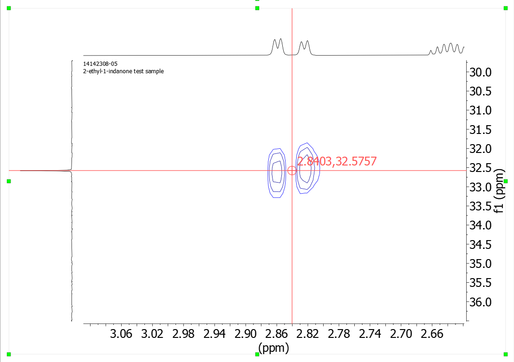
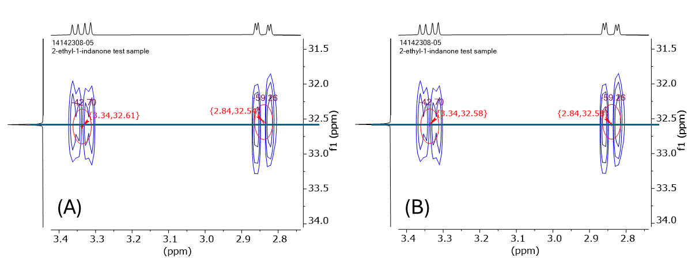

Snap To Carbon HSQC
===================

Introduction
------------

This tool is used when the HSQC peaks are picked manually. When this
occurs, the carbon coordinates of the HSQC peaks may be different from
the values in the 1-D carbon spectrum. This can lead to problems when
the simpleNMR program attempts to harmonise all the different spectra
and assign the carbons to their CH\ :sub:`n` group and to specific atoms
in the molecule.

This tool attempts to move the carbon coordinates in the HSQC spectrum
to the 1-D carbon spectrum values.

Using the Tool
--------------

Peak pick the HSQC spectrum manually using the standard tools in MNOVA.
Try to be as precise as possible by aligning the position of the peak
over the carbon 1-D projection and the centre of the proton peak or
multiplet.

Figure 1 Manually peak pick the HSQC spectrum making sure the position
is close to the carbon 1-D resonance as possible and at the centre of
the proton multiplet, not on the peak maximum.

Once all the peaks have been picked, integrate the peaks using the
simpleNMR 2-D integrate button. Then click on the Snap to Carbon button
adjust the carbon coordinates of the HSQC peaks so that match the 1-D
carbon values.

In Figure 2.A below one can see that the two diastereo-isomer peaks have
been picked slightly above and below the position of the carbon
resonance displayed at the side. In Figure 2.B the picked peaks are now
aligned with the carbon resonance after the snaptocarbon button has been
pressed

Figure 2 Alignment of manual peak-picking to carbons after clicking the
snaptocarbon button. (A) Before. (B) After.
