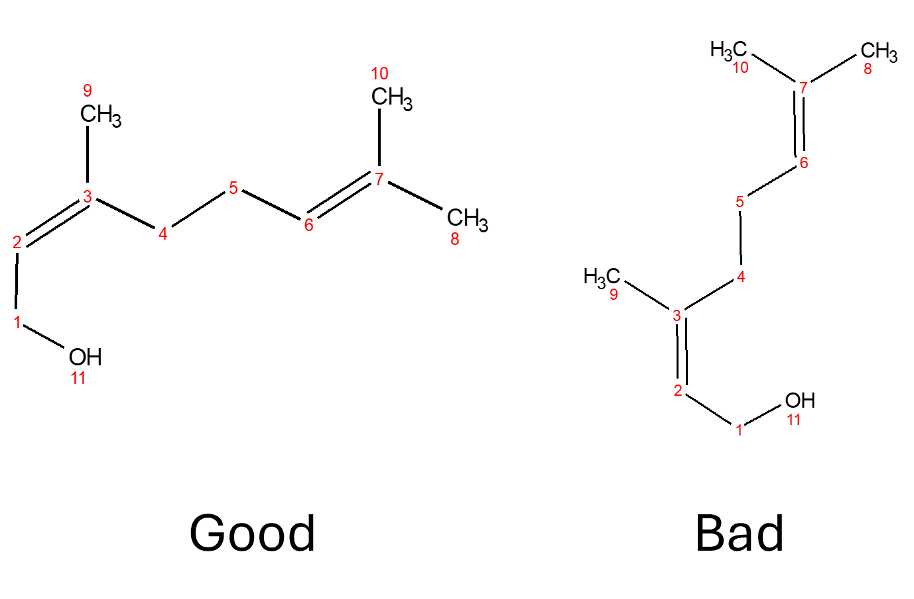

Structures
==========

Introduction
------------

The simpleNMR suite of tools requires a molecular structure to work
with. The following provides some guidelines for preparing structures to
use with the suite.

Guidelines
----------

-  While we use the term “molecular structure” somewhat loosely in these
   documents, the simpleNMR suite of tools actually facilitates
   structural isomer verification (for a fuller discussion of this
   distinction see “SimpleNMR: An interactive graph network approach to
   aid constitutional isomer verification using standard 1D and 2D NMR
   experiments”, E. Hughes, A. M. Kenwright, *Magn. Reson. Chem*.
   (2024), **62**, 556–565). So, while it is possible to use molecular
   structures that contain stereochemical features such as stereo bonds,
   these have no effect on the functioning of the program. The simpleNMR
   suite aims to answer the question “Are these NMR spectra consistent
   with the postulated structural isomer (in terms of number of signals,
   approximate carbon chemical shift, and 2D correlations), and can an
   assignment be made on that basis?” While the answer to that question
   may be yes, that does not necessarily imply that the stereochemistry
   you have drawn is correct. So, it may be preferable to draw the
   structure without stereo bonds as a reminder that the results from
   the simpleNMR suite contain and/or imply no information about
   stereochemistry.

-  While carbon shift prediction packages (as used in the simpleNMR
   suite) generally take no account of R/S stereochemistry, the MNOVA
   prediction package (if available) does take account of the E/Z
   configuration of double bonds and will return a better answer if the
   correct configuration is drawn, but this will not affect assessment
   of correlations. So, care needs to be taken in reaching conclusions
   about double bond configurations.

-  Structures must be 2D. The simplePREDICT tool will not work correctly
   with 3D structures

-  The structures must be drawn without explicit hydrogens except for
   those attached to terminal carbons and hetero atoms.

-  If a specific orientation of the molecule and/or numbering scheme is
   desired in the final report it is worth spending some time getting
   this right before starting with simpleNMR. Possibly the best way of
   doing this is to produce the desired molecular structure and
   numbering scheme using ChemDraw and then import that structure into
   MNOVA using the ChemDraw Exchange File format (see the section on
   Molecular Structure in the MNOVA manual).

-  | If the molecular structure has unequal dimensions (longer on one
     axis), the longer axis should be horizontal in order to make best
     use of the available computer screen real-estate.
   | |good and bad orientation|

Figure 1 Good and Bad orientation of molecule when using simpleNMR tools

